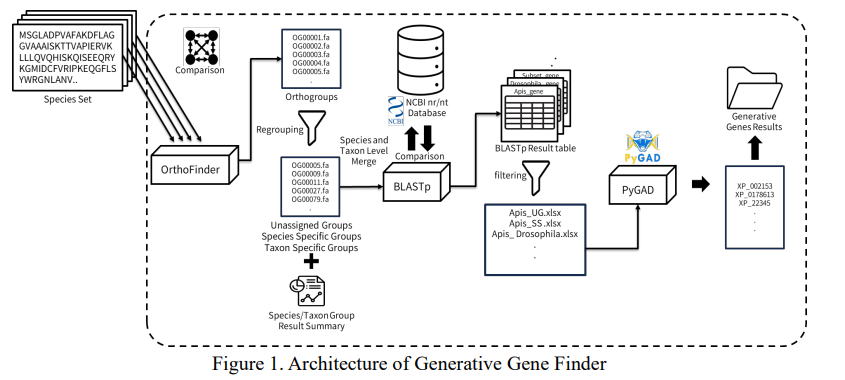

# 🧬 Generative Gene Finder (GGF)
### 돌연변이 경로 시뮬레이션 기반 생성 유전자 탐색 프레임워크

[ICBCB 2026 / Generative Genomics Workshop]

국내 다수 대학 연구진 및 여러 연구실이 참여한 **다학제 공동 연구 프로젝트**
[관련 뉴스](https://www.hankyung.com/article/2025112825431 )

## Overview

본 프로젝트는 **비교 유전체학(Comparative Genomics)** 환경에서 기존 정렬(alignment) 기반 방법으로는 기원을 설명하기 어려운 **orphan gene**을 대상으로, 해당 유전자가 **진화적 돌연변이 과정을 통해 생성될 수 있었는지**를 계산적으로 검증하기 위한 **통합 파이프라인**을 제안

기존 연구는 orphan gene을 “다른 종에 상동 서열이 없는 유전자”로 정의하고 탐색 자체에 초점
→ **그 유전자가 실제로 생성 가능했는지(feasibility)**에 대한 분석은 부족

본 연구에서는 orphan gene 탐색을 단순한 **발견(detection)** 문제가 아닌 **생성 가능성(generative feasibility)** 문제로 재정의 및 검증 프레임 워크 제안 


## Motivation

### 기존 orphan gene 연구의 한계

- BLAST 등 정렬 기반 방법은 orphan gene의 **기원(origin)**을 설명할 수 없음
- 탐색, 검증, 진화 분석이 **나뉘어져 수행**

### 문제 인식

- orphan gene은 단순한 “예외”가 아니라 **새로운 유전자 생성 메커니즘의 단서**일 수 있음
- “존재 여부”가 아니라 **“생성 가능성”을 함께 검증할 필요성**
- 이를 위한 **End-to-End 프레임워크 부재**


## Key Insight

> orphan gene을 정렬되지 않는 유전자”가 아니라 **“진화적으로 생성될 수 있었는지 검증해야 할 대상”

즉,  
- 이 유전자가 다른 종에 존재하는가? 가 아니라  
- 이 유전자가 돌연변이 경로를 통해 생성될 수 있었는가? 를 질문

## Proposed Pipeline


```

OrthoFinder
↓
Species / Taxon-specific Orphan Gene 후보
↓
BLASTp 또는 DIAMOND (NCBI nr)
↓
정제된 Generative Gene 후보
↓
돌연변이 경로 시뮬레이션 (Genetic Algorithm)
↓
Annotation 및 확률 기반 검증
```

## System Architecture

### Input
- 여러 종(species)의 단백질 서열 데이터

### Output
- 생성 가능성이 검증된 generative gene 후보
- 돌연변이 경로 존재 여부
- 종/분류군 특이적 orphan gene 리스트

---

## Orphan Gene Identification

### OrthoFinder 기반 후보 추출

- 다종 단백질 서열 비교 수행
- 다음 후보군 도출:
  - Species-specific orphan genes
  - Taxon-specific orphan genes
- 이후 BLAST 단계의 탐색 공간을 효과적으로 축소
→ 계산 효율성과 후보 정밀도 동시 확보

---

## Homology Refinement

### BLASTp / DIAMOND

- NCBI nr 데이터베이스 기반 상동성 검증
- 타 종에서 발견되는 서열 제거
- **DIAMOND 옵션 제공**으로 대규모 실험 가능

#### 실행 시간 비교 (Apis 종)
- BLASTp: 약 65시간
- DIAMOND: 약 9시간

---

## Orphan Gene Definition Sensitivity

orphan gene 정의는 파라미터에 매우 민감함을 확인

### E-value 설정에 따른 결과 변화 (Drosophila 종)

- e-value = 0.001 → 360개 orphan gene
- e-value = 0.05 → 41개 orphan gene

→ orphan gene 개수는 절대적 값이 아니며 **표준화된 기준과 민감도 분석이 필수적**임을 시사

## Mutational Path Simulation

### 핵심 아이디어

orphan gene이  
- 기존 유전자의 점진적 돌연변이 결과인지  
- 혹은 완전히 새로운 생성 유전자인지 구분하기 위해 **돌연변이 경로 시뮬레이션**을 수행

### 구현 방식

- **PyGAD 기반 유전 알고리즘**
- 돌연변이 시나리오:
  - 무작위 돌연변이
  - 확률적 돌연변이
- 반복 시뮬레이션을 통해  
  해당 서열이 생성될 **가능성(feasibility)** 평가

## Annotational Validation

- Annotation 데이터베이스:
  - FlyBase
  - WormBase
- Biological Foundation Model 활용
  - 비현실적인 서열 패턴 제거
  - 토큰 단위 likelihood 계산
  - 확률 누적 기반 검증

## System Characteristics

- Orphan gene 탐색과 진화적 검증을 통합한 End-to-End 파이프라인
- BLAST / DIAMOND 선택 가능
- 돌연변이 기반 생성 가능성 평가
- 다양한 종 비교 실험 지원
